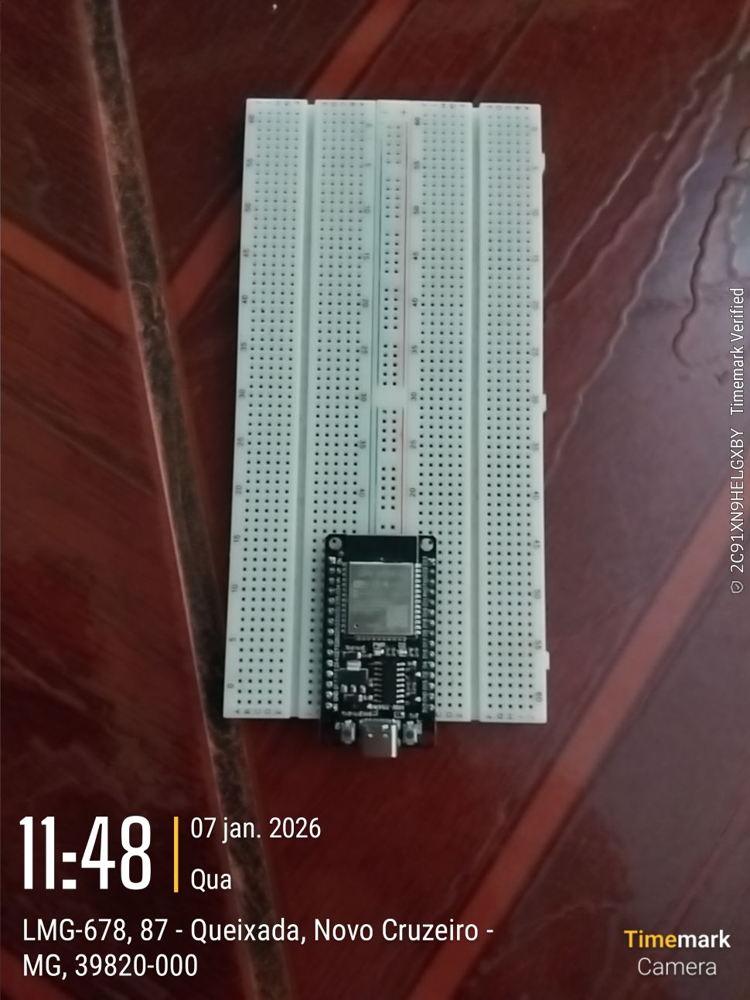
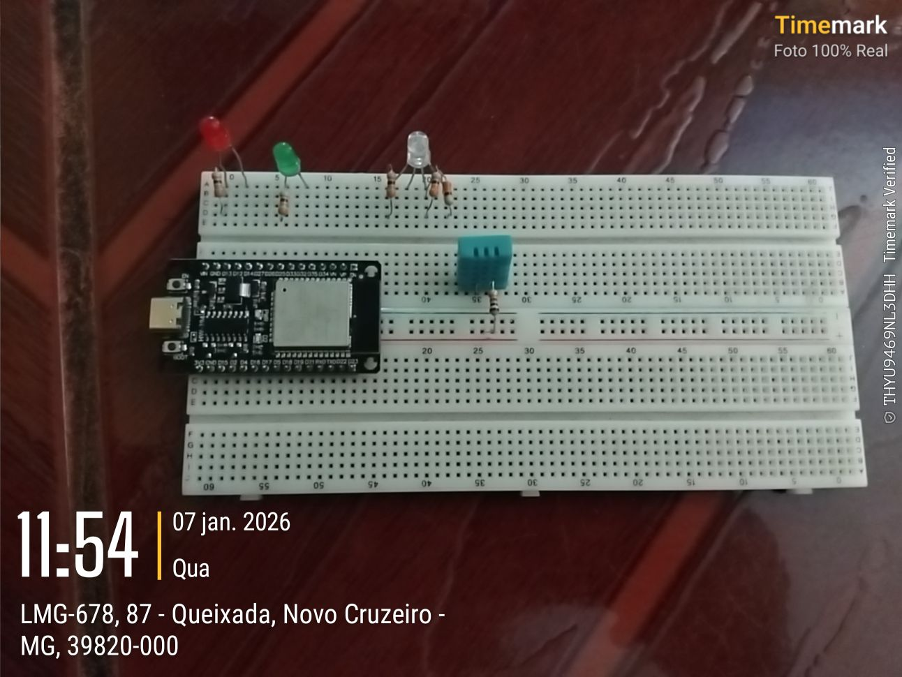
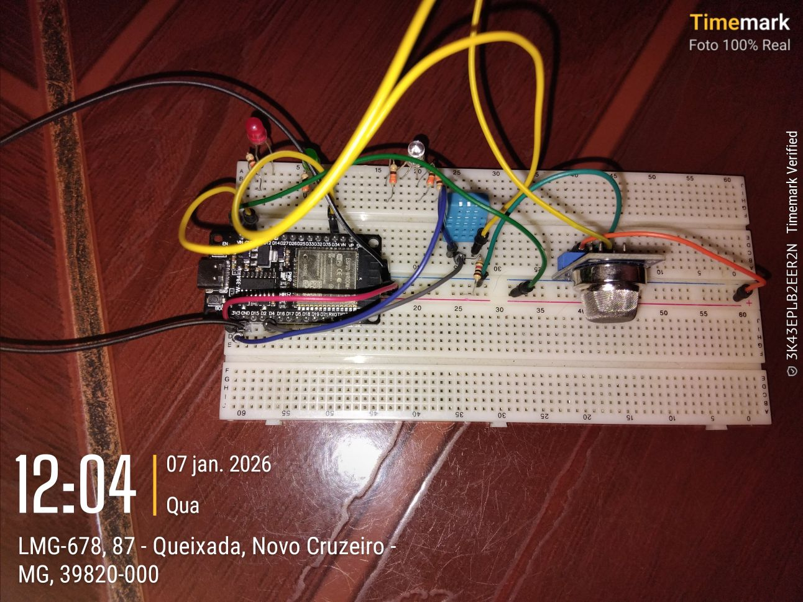
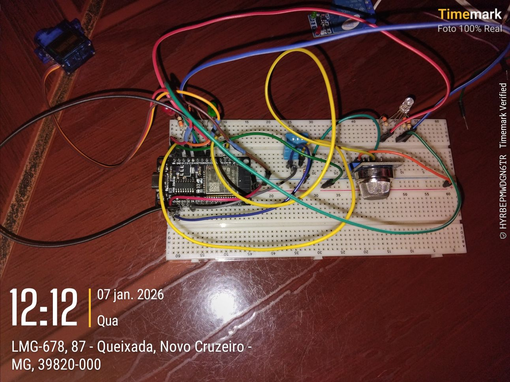
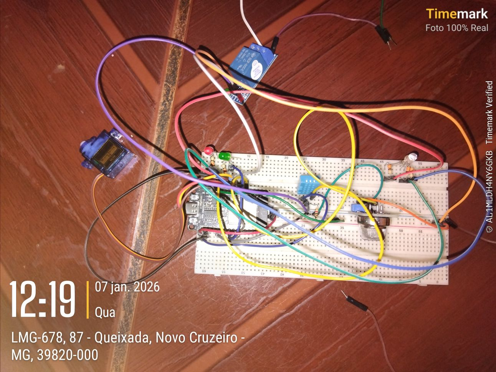
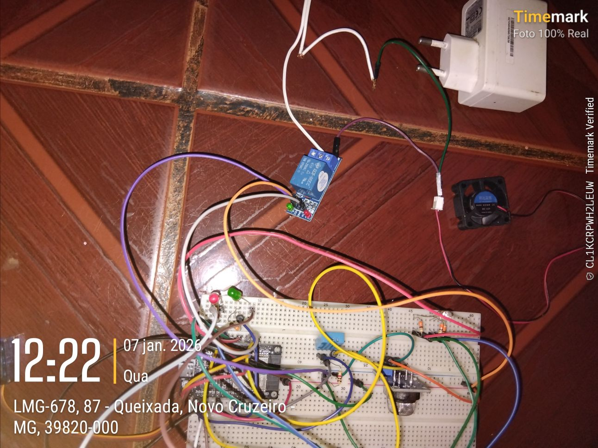

# 📅 Devlog - 7 Janeiro 2026 (Hardware Assembly)

## 🛠️ Montagem do Setup e Hardware

Este devlog registra o processo de montagem e o ambiente de trabalho físico utilizado para o desenvolvimento do projeto HOMES e seus subsistemas.

### 📸 Registro Visual (Proof of Work)

As imagens abaixo documentam a estação de trabalho e o hardware em uso.

#### Estação de Trabalho

#### Vídeo de Registro
[🎥 Assistir Vídeo de Montagem (MP4)](../assets/devlog/2026-01-07-hardware/2026-01-07%2011.45.01_87,%20LMG-678.mp4)

#### Timemarks (Rastreamento de Tempo)

#### Toggl Track

---

## 📝 Observações
- O ambiente está configurado para permitir o desenvolvimento mobile-first via Termux.
- O rastreamento de tempo (Toggl) é essencial para o Hackatime.
