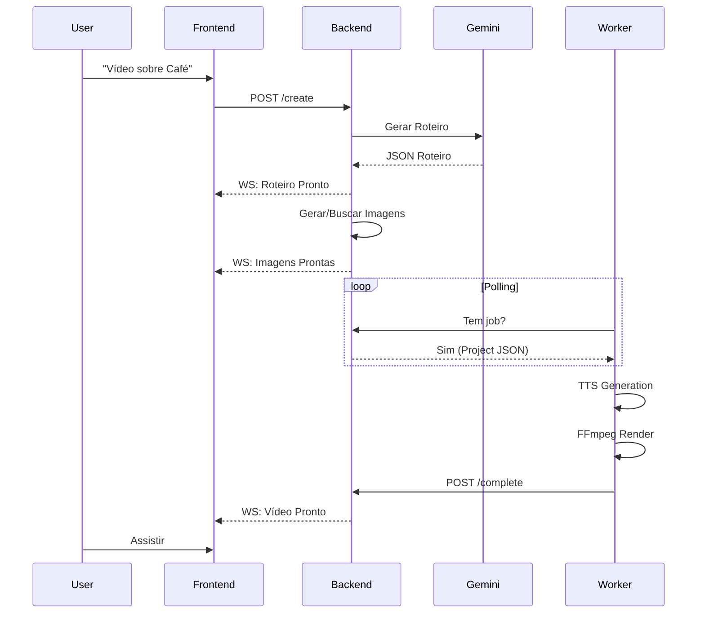

# 🔄 Fluxo de Integração (Integration Flow)

Este documento descreve detalhadamente como os dados viajam entre os componentes do ecossistema HOMES.

---

## 📡 Visão Geral da Comunicação

O sistema utiliza um modelo híbrido de comunicação:
1. **HTTP (REST)**: Para ações iniciadas pelo usuário (criar projeto, salvar config).
2. **WebSocket (Socket.IO)**: Para atualizações de estado em tempo real (progresso, logs).
3. **Polling**: Para o Worker (Termux) buscar tarefas sem expor porta pública.

---

## 1. Criação do Projeto (Trigger)

**Ator**: Usuário (Frontend)
**Ação**: Envia comando de voz ou texto.

1. **Frontend** captura áudio via Web Speech API -> Transcreve para Texto.
2. **Frontend** envia `POST /projects` para o **Backend**.
   ```json
   {
     "prompt": "Vídeo sobre a história do café",
     "style": "documentary",
     "aspectRatio": "9:16"
   }
   ```
3. **Backend** cria registro no Firestore com status `PENDING_SCRIPT`.
4. **Backend** retorna `201 Created` com `projectId`.

---

## 2. Orquestração e IA (Backend)

**Ator**: Backend (NestJS)
**Ação**: Gera roteiro e define assets.

1. **Backend** detecta novo projeto (Event Listener).
2. **Backend** chama **Gemini API** com o prompt do usuário + Brand Profile.
3. **Gemini** retorna JSON estruturado:
   - Roteiro (Narração).
   - Prompts de imagem para cada cena.
   - Sugestão de BGM (Background Music).
4. **Backend** atualiza Firestore: status `GENERATING_ASSETS`.
5. **Backend** emite evento WebSocket `project.update` -> **Frontend** exibe "Gerando roteiro...".

---

## 3. Geração de Assets (Backend/Cloud)

**Ator**: Backend
**Ação**: Prepara os arquivos para o renderizador.

1. **Backend** chama API de Imagem (ou busca em banco de stock).
2. Imagens são salvas no Firebase Storage.
3. URLs das imagens são adicionadas ao documento do projeto.
4. Status atualizado para `READY_TO_RENDER`.

---

## 4. Renderização (Worker/Edge)

**Ator**: HOMES-Engine (Termux)
**Ação**: Baixa, processa e renderiza.

1. **Worker** roda loop infinito (`queue_poller.py`) consultando `GET /projects/pending`.
2. **Worker** recebe JSON do projeto `READY_TO_RENDER`.
3. **Worker** inicia pipeline local:
   - **TTS**: Gera áudio (`.mp3`) para cada bloco de texto usando Edge-TTS.
   - **Download**: Baixa imagens e música de fundo.
   - **FFmpeg**: 
     - Aplica Zoom (Ken Burns).
     - Sincroniza áudio e vídeo.
     - Gera legendas (opcional).
     - Renderiza arquivo final `final_render.mp4`.
4. **Worker** envia `POST /projects/{id}/complete`:
   - Envia URL local ou faz upload do vídeo (configurável).
5. **Worker** dispara notificação nativa no Android (`termux-notification`).

---

## 5. Feedback e Entrega

**Ator**: Frontend
**Ação**: Notifica usuário.

1. **Backend** recebe confirmação de conclusão.
2. **Backend** emite evento WebSocket `project.completed`.
3. **Frontend** exibe modal: "Seu vídeo está pronto!".
4. Usuário pode assistir no navegador ou baixar.

---

## 🧩 Diagrama de Sequência Simplificado


